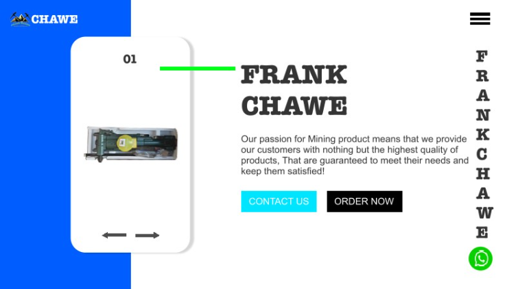
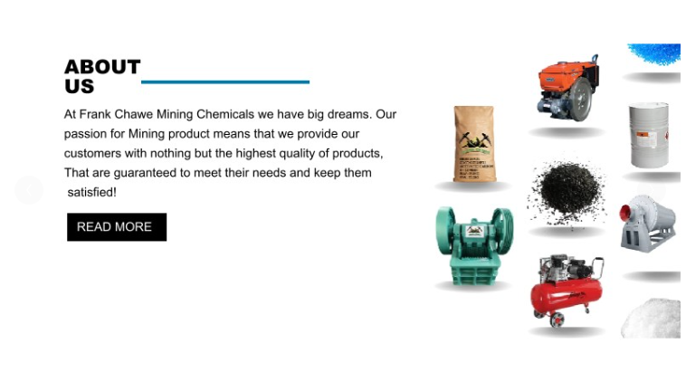
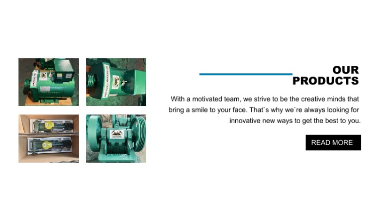
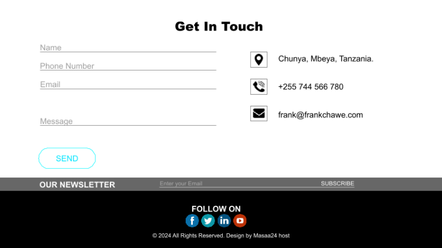

# Frank_chawe

### About
Frank_chawe is a web project showcasing a responsive and interactive website. This project includes various HTML, CSS, SCSS, and JavaScript files to build a comprehensive user interface.

### Features
-	Responsive Design: Ensures compatibility across different devices and screen sizes.
-	Interactive Elements: Includes dynamic features built with JavaScript.
-	Modern UI: Utilizes SCSS for flexible and maintainable styles.

### Prerequisites
-	HTML
-	CSS
-	JS

### Usage
This website can be used as a template for creating a modern, responsive business or portfolio site. It includes sections for showcasing products, providing information about the business, and facilitating contact with visitors.

To use this template: 

1.	Customize the HTML files with your content. 
2.	Modify the SCSS/CSS to match your branding. 
3.	Add any additional JavaScript functionality as needed. 
4.	Host the files on a web server or a service like GitHub Pages. 
## Screenshots

 
 
 
 

### License
This project is licensed under the MIT License.

### Contact
For questions, feedback, or support, you can reach us at: 
Email: tharushakavinda01@gmail.com 
GitHub: TharushaK01 
X : KavindaTharusha 
